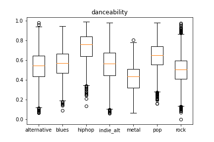
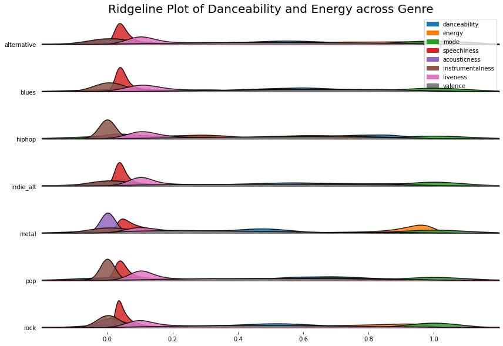
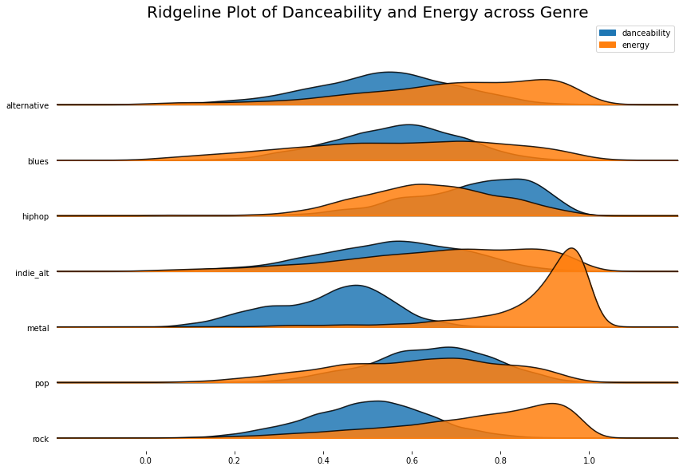
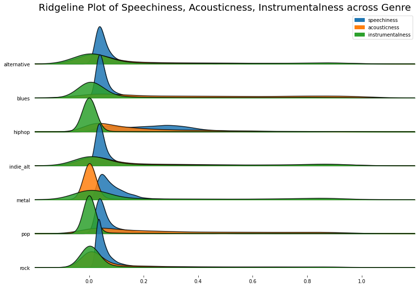
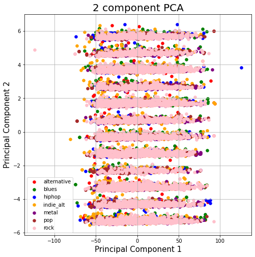
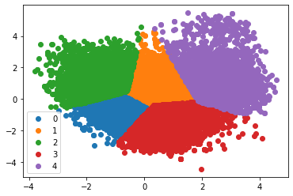
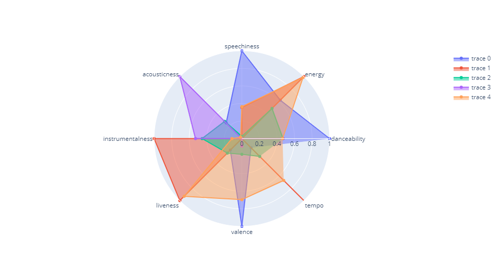

# Abstract

############### Empty for now ###############

# Introduction
	
Music can be seen as a medium to bring people together. However, when someone asks "What type of music do you like?", it could bring about unnecessary complications. Modern music even with the same genre can be vastly different in terms of musical features. Genre labels serve as very broad terms that classify the music of specific types, however, different artists of a specific genre might have vastly different styles. In this paper, we analyze the possibility of classifying music based on musical features. 

The dataset that we will be using is a Spotify dataset that contains a total of 6 broad genres. These genres include alternative, blues, hip hop, indie alternative, metal, pop, and rock. The dataset contains a total of 22 columns which include the features we are interested in analyzing. The following are some of the features with more details:
* Danceability: How suitable a track is for dancing. 
* Energy: The precepted intensity of a track. 
* Loudness: Overall decibels(dB)
* Speechiness: Measures the presence of spoken words.
* Acousticness: A confidence measure of whether or not a track is acoustic. 
* Instrumentalness: Measures the lack of presence of vocals. 
* Liveness: The likelihood that a track was performed live.
* Valence: The conceptual musical positivity of a track. 
* Tempo: The speed or pace of the track. 

Across this dataset, we will be performing basic data exploration to visualize the data, logistics regression to see if we can figure out connections between feature and genre, as well as PCA and KMeans clustering to classify the dataset based on features. 

## Data Exploration 
### Boxplots
We used boxplots in order to analyze the distribution of data for each of the features across different genres. Boxplots help in visualizing the min, max, and calculating the mean of the features. Some of the features that showed the most variance across genres include danceability, energy, and valence.  

According to figure 1 hip hop has a very high average danceability compared to metal. 

Figure 2 shows that metal has a significantly higher average for energy. The range for energy is also small, which signifies that on average high energy can be used to determine metal music.

Figure 3 shows the distribution of valence across genres. This boxplot shows that metal has a significantly lower valence in comparison to the rest of the genres whereas blues has higher max values for valence. 

Distinguishing features in genres that may be useful in classification include a high acousticness rating for blues, higher speechiness and danceability in hiphop, and high energy and low valence in metal. Features that did not show meaningful changes between genre included tempo and liveness.  

### Ridgeline Plots
Ridgeline plots allowed us to compare the visualization of feature distribution across genres more easily. We used ridgeline plots in order to determine whether or not there were any correlations between features and genres. 

This ridgeline plot shows all the features mapped against one another, however, the overlap in frequency between the features made it difficult to glean any meaningful information. 

Figure 5 shows a ridgeline plot mapping danceability against energy across all the genres. This allowed us to visualize the high energy in metal and the high danceability in hip hop. The initial thoughts on the results of this ridgeline seem to indicate that high energy does not necessarily result in high danceability. 

Figure 6 shows a mapping that compares speechiness, acousticness, and instrumentalness. The initial thought in regards to these three features was that they span similar ranges on the ridgeline and all seemed to be related to the medium used in producing the music. In our analysis, ridgeline plots of independent features were also utilized, however are not included in this paper, overall the ridgeline plots helped in data visualization for the frequency of the features. 

## Statistics 

We were able to generate the corresponding mean and standard deviation for features across genres, however, it was difficult to draw any meaningful conclusions at this stage of the analysis. Some of the patterns that we were able to see include the connection between energy and metal, and the connection between instrumentalness, pop and hiphop. These indicate that energy would be a good feature in identifying metal and that instrumentalness *may* be a good feature in identifying hip hop as well as pop. 

# Methods
## Logistic Regression 
The use of logistics regression with be to help with identifying the most influential features across genres. We accomplish this by creating a logistic model for each genre. We then analyze the coefficients of the results to determine which features are statistically significant. The models will be trained using a '1 vs many' algorithm in which each genre will be independently measured against a collection of all other genres. This will hopefully allow us to realize the significant features that are useful for identifying each specific genre. 
In order to balance our model, during the training process we use the same amount of songs from the 1 genre vs the many genres. For example, while training the model for metal we used 3045 songs from the metal genre along with a random pool of 3045 songs from all the other genres. Instead of using logistic regression to build a classifier, we are more so using it to determine significant variables for distinguishing genres. 
### Summary of Logistics Regression 
Across all genres, key, liveness, and tempo were the three most commonly insignificant variables in the regression. We had hoped that this analysis would do a better job of weeding out variables that didn't greatly influence the genre, but after actually creating these logistic models, that was not the case.

The main issue is that a summary of coefficients for logistic regression can only tell us what features are not significant for identifying a particular genre. Unfortunately, it cannot tell us what the most important features are. In the next round of analysis, we will perform forward and backward feature selection. This will identify which features cause the most change in the logistic model, and thereby influence each genre of music the most.
## PCA 
We use PCA for dimensional reduction to make clustering of the music based on features more malleable. Figure 9 shows a scatterplot mapping PC1 vs PC2 for each of the tracks across the genres. 

In this graph Principal component, 1 represents the eigenvector which explains most of the information variance.

Figure 10 shows a graph mapping cumulative explained variance across the number of components, we utilize this after fitting our PCA model in order to figure out the number of components needed in order to obtain the most desirable variance. This graph shows how much of the total 7 dimensions are contained within the first N components. We can see that two or more components are required to describe close to 100 percent of the variance. 
## Clustering
We used K-means clustering in order to classify the music tracks based on their features. Before we handle any of the clustering we need to first use a scaler to normalize the data since not all of the features operate on the same scale. Although a majority of the features operate on a scale of [0-1], tempo uses [0-300], and loudness uses [-40-0]. If we do not first normalize the data the results will be extremely skewed towards tempo and loudness. In our initial analysis, we explored creating 5 clusters to classify the tracks. In the second round of analysis, we will be exploring the use of more clusters, as 5 seemed to be the minimum in achieving manageable results with noticeable differences. 

Figure 11 shows the plots for each of the tracks into clusters. This was created using the entire dataset so with a total of 26752 song entries and all of their following features into 5 clusters. With the following rounds of analysis, we will test to see if we can find the optimal combination between a number of tracks and clusters. 
In order to more easily visualize the results, we used radar charts to map the clusters. The radar charts were created with the average of each genre across the features that were used in the clustering process. All the features were normalized before creating the radar charts.

### Conclusion on Clustering Analysis
Based on the results of the radar chart created from the average values of each of the five clusters we were able to obtain these results: 
* Cluster 0: This cluster contained tracks that featured high speechiness, danceability, and valence. 
* Cluster 1: This cluster contained tracks that had high instrumentalness, energy, tempo, and liveness
* Cluster 2: This cluster was the averaged cluster, this included all the moderate tracks with no real outliers in features. 
* Cluster 3: This cluster was high in acousticness
* Cluster 5: This cluster was similar to cluster 1, it had high energy and liveness, however, opposed to cluster 1, cluster 5 also had a moderate valence and a lower tempo. 

In this preliminary analysis, we did not take into consideration the possible genres for each of the tracks. Future attempts could include incorporating the cluster number back into the dataset and cross-referencing the cluster traits with the perceived genre traits. 
# Conclusions

############### Empty for now ###############

# References
